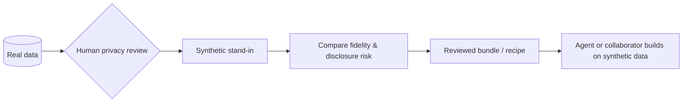
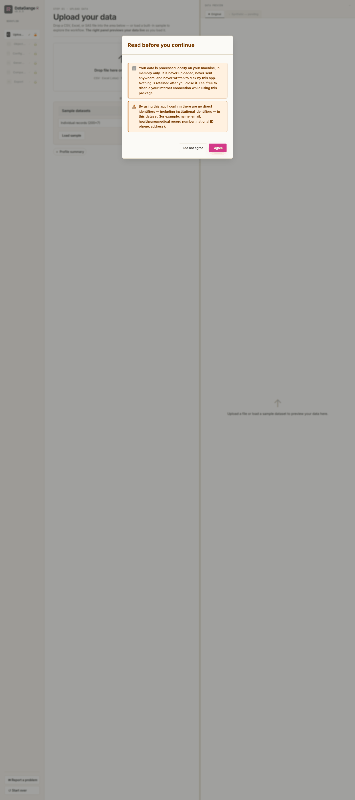
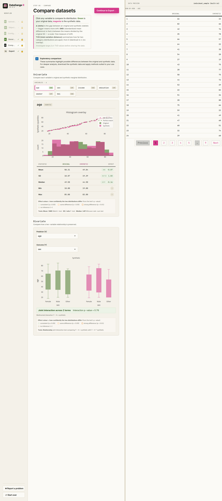

# DataGangeR 

<!-- badges: start -->
[](https://CRAN.R-project.org/package=dataganger)
[](https://github.com/lennon-li/dataganger/actions/workflows/R-CMD-check.yaml)
[](https://dataganger.biostats.ai/)
<!-- badges: end -->

**Synthetic data doubles for safer AI and Agent prototyping.**

DataGangeR turns a real dataset into a reviewable synthetic stand-in so you can
prototype analyses, Shiny apps, teaching examples, and Agent workflows while
reducing direct exposure of the original records.

The workflow is deliberately **human-gated**: you review privacy-sensitive roles
before synthesis, inspect fidelity and disclosure warnings afterward, and decide
what leaves your machine.

**Current CRAN release: 0.8.2**

- Documentation: <https://dataganger.biostats.ai/>
- CRAN: <https://CRAN.R-project.org/package=dataganger>
- Source: <https://github.com/lennon-li/dataganger>

## Why DataGangeR?

Coding Agents can be useful for building data products, but giving an Agent the
original records is often unnecessary. DataGangeR provides a different workflow:



The package is designed so an Agent can work from the reviewed synthetic output
or a reproducible recipe rather than reading the original records directly.

### Design commitments

- **Local processing.** Core package workflows do not require network calls.
- **Human-gated privacy decisions.** Direct identifiers and sensitive roles are
  reviewed before synthesis.
- **Reviewable output.** Fidelity checks, exact-match checks, and disclosure-risk
  warnings are surfaced before export.
- **Reproducible Agent handoff.** Exported bundles include the synthetic data,
  recipe, manifest, and Agent instructions.
- **Open and auditable.** The package and its CI are public, including a dedicated
  no-network test job.
- **No privacy overclaim.** Synthetic data can reduce direct disclosure risk; it
  does **not** guarantee anonymity, regulatory compliance, or safe public release.

## Install

```r
install.packages("dataganger")
```

For relationship-aware synthesis, installing `synthpop` is strongly recommended:

```r
install.packages("synthpop")
```

Then launch the guided app:

```r
library(dataganger)
run_app()
```



## A minimal R workflow

Every step used by the app is also available as an R function.

```r
library(dataganger)

dat     <- read_input("my-data.csv")
profile <- profile_data(dat)
roles   <- detect_roles(dat, profile)
spec    <- synth_spec(purpose = "development", roles = roles, seed = 42)
syn     <- synthesize_data(dat, spec, roles)

export_synthetic(
  syn,
  original = dat,
  path = "dataganger_bundle.zip"
)
```

Or create an Agent-ready bundle in one call:

```r
make_agent_bundle(
  "my-data.csv",
  out = "dataganger_bundle.zip",
  seed = 42
)
```

## What the bundle contains

```text
synthetic_data.csv            # reviewed synthetic stand-in
human/human.md                # what was done + privacy notes
human/comparison_report.html  # fidelity and relationship checks
agent/recipe.yaml             # spec + roles + seed
agent/AGENT.md                # workflow instructions for an Agent
agent/manifest.json            # bundle metadata
```

The recipe makes the approved synthesis process reproducible without putting the
real records into the shared bundle.

## Guided privacy workflow

The Shiny app takes the user through six stages:

1. **Objective** — choose a synthesis posture for development, demo, or analytics.
2. **Upload** — load a supported file or a built-in example.
3. **Configure** — review identifiers and sensitive roles column by column.
4. **Generate** — create the synthetic stand-in.
5. **Compare** — inspect univariate and relationship-level fidelity.
6. **Export** — review disclosure warnings and create the bundle.

The preview flags exact synthetic-to-original row matches. Export is blocked when
populated sensitive values are reproduced exactly unless the user regenerates or
explicitly acknowledges the remaining risk after review.

| Classify columns | Compare real vs. synthetic |
| :---: | :---: |
|  |  |

For the complete privacy model, see the
[privacy and Agent workflow vignette](https://dataganger.biostats.ai/articles/privacy-and-ai-workflow.html).

## Synthesis engines

DataGangeR supports two synthesis paths:

- **`synthpop`** — recommended for relationship-aware synthesis.
- **Internal engine** — dependency-light fallback for marginal synthesis.

The `development`, `demo`, and `analytics` objectives choose different defaults
for fidelity and disclosure posture. Higher-fidelity settings require more careful
review and, where applicable, explicit risk acknowledgement.

When using the `synthpop` engine, please cite:

> Nowok B, Raab GM, Dibben C (2016). “synthpop: Bespoke Creation of Synthetic
> Data in R.” *Journal of Statistical Software*, 74(11), 1–26.
> doi:10.18637/jss.v074.i11

## CLI / Agent workflow

The same pipeline is available from the command line:

```sh
dataganger profile my-data.csv --out profile.json
dataganger roles my-data.csv --out roles.yaml
dataganger spec --purpose development --out spec.yaml
dataganger synthesize my-data.csv --spec spec.yaml --out dataganger_bundle.zip
dataganger inspect dataganger_bundle.zip
```

Print or copy the packaged Agent workflow guide with:

```sh
dataganger skill
```

## Supported input formats

- CSV
- Excel (`.xlsx`, `.xls`)
- SAS (`.sas7bdat`, `.xpt`)

## Security and privacy

DataGangeR is intended to reduce unnecessary exposure of original records during
prototyping. It is **not** a formal anonymization guarantee and does not replace a
privacy, legal, or regulatory assessment.

Do not post sensitive data, synthetic output derived from sensitive data, or
credentials in public GitHub issues. See [SECURITY.md](SECURITY.md) for private
reporting guidance.

## Project status

The current release is available from CRAN and is tested through GitHub Actions on
Windows, macOS, Linux release/devel/oldrel, a dedicated `synthpop` path, and a
network-disabled test job.

See [NEWS.md](NEWS.md) for release history and the
[documentation site](https://dataganger.biostats.ai/) for the full reference and
vignettes.

## License

MIT © Lennon Li
