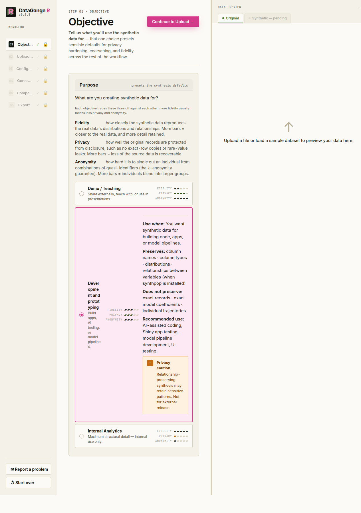
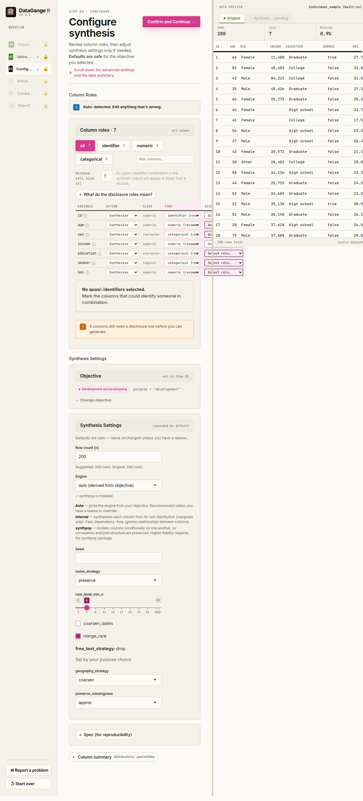

# Getting started with the app

The DataGangeR Shiny app guides you from a real dataset to a shareable
synthetic double in six steps. Launch it with:

``` r

library(dataganger)
run_app()
```

Every screen mirrors a plain function call, so anything you do here you
can also script from the R console (see *Use it from R* in the
[README](https://github.com/lennon-li/dataganger#use-it-from-r)).

## 1. Objective

Start by telling DataGangeR what the synthetic data is *for*. The
objective — **Demo / Teaching**, **Development and prototyping**, or
**Internal Analytics** — presets sensible defaults for fidelity, privacy
hardening, and coarsening across the rest of the workflow.



## 2. Upload

Drop in a CSV, Excel, or SAS file — or load one of the built-in sample
datasets to explore the workflow without any real data. The right-hand
panel previews your data live as it loads.



## 3. Configure

Review each column’s **disclosure role** (direct identifier,
quasi-identifier, sensitive, or none) and adjust synthesis settings only
if you need to. Defaults are safe for the objective you picked. Every
column must carry an explicit role before you can generate — uncertain
columns are left unselected on purpose.


## 4. Generate

Generate the synthetic double. The summary reports row and column
counts, the engine used, and the elapsed time; the right panel switches
to preview the synthetic records.


## 5. Compare

Inspect how faithfully the synthetic data mirrors the original. Pick any
variable to see overlaid distributions (green is your original data,
magenta is synthetic), a Q–Q plot, and a side-by-side statistics table
with the delta between them.


## 6. Export

Download a single bundle containing the synthetic data, the synthesis
spec, a manifest, a comparison report, diagnostic files, and
(optionally) a standalone data dictionary - ready to share with
collaborators or AI programming tools.


> **Remember:** synthetic data reduces direct disclosure risk; it does
> not replace a formal privacy assessment. Review the comparison and
> privacy warnings before sharing any output externally.

## Reporting problems and feedback

If something feels off, you can open a pre-filled GitHub issue straight
from R:

``` r

report_issue("The export summary was confusing", context = "Shiny app")
```

The Shiny app also includes a **Report a problem** button in the
sidebar. Both paths open your browser with environment details filled
in, but they do not send anything automatically - you stay in control of
what gets submitted.
