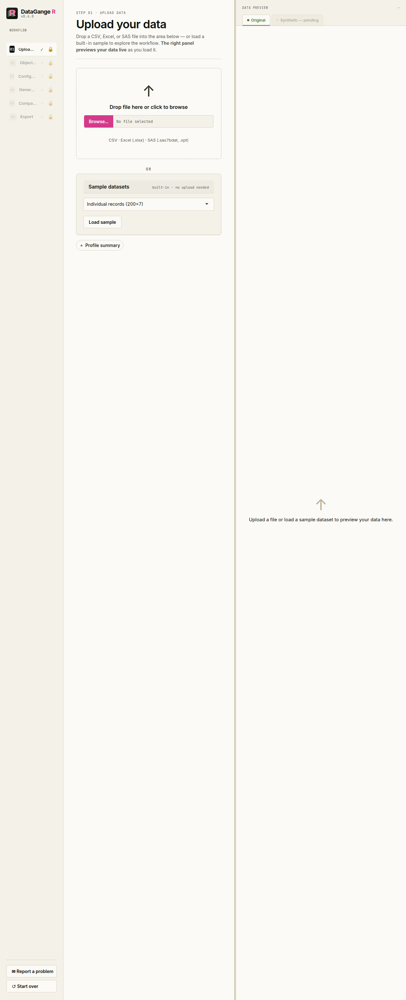
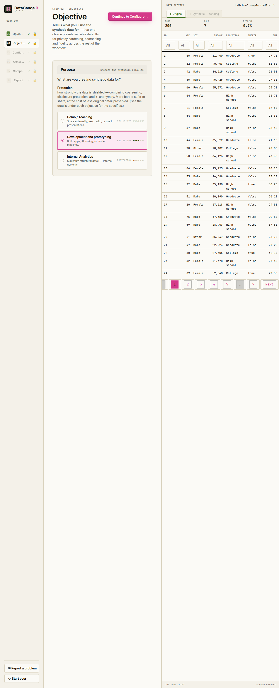
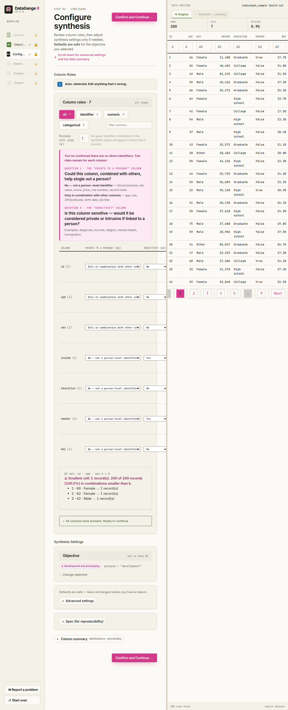
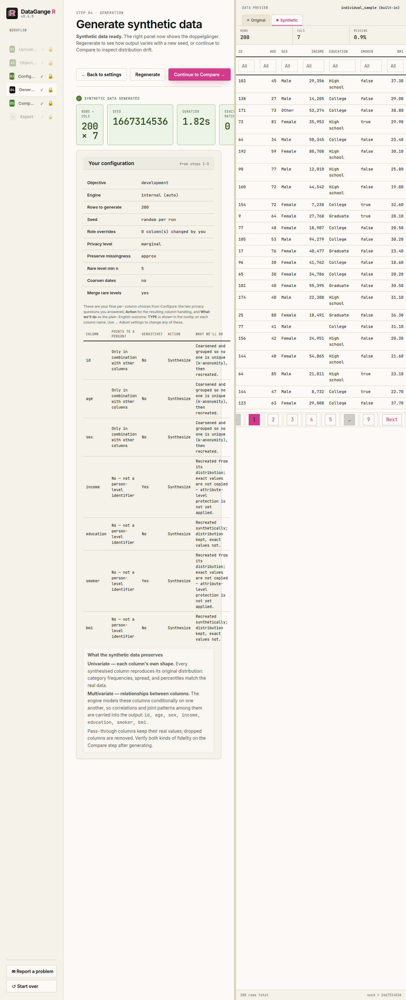
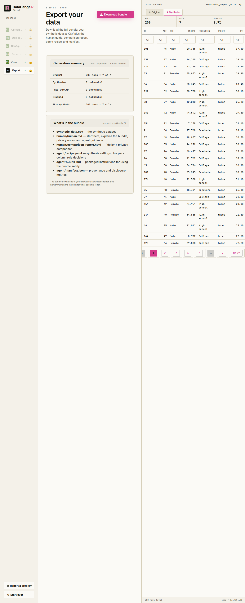

# Getting started with the app

The DataGangeR Shiny app guides you from a real dataset to a shareable
synthetic double in six steps. Launch it with:

``` r

library(dataganger)
run_app()
```

Every screen mirrors a plain function call, so anything you do here you
can also script from the R console (see *Use it from R* in the
[README](https://github.com/lennon-li/dataganger#use-it-from-r)).

## 1. Upload

Drop in a CSV, Excel, or SAS file — or load one of the built-in sample
datasets to explore the workflow without any real data. The right-hand
panel previews your data live as it loads.



## 2. Objective

Next, tell DataGangeR what the synthetic data is *for*. Instead of
separate Fidelity / Privacy / Anonymity meters, the app shows one
**Protection** meter: **Demo / Teaching = 5 bars**, **Development and
prototyping = 3 bars**, and **Internal Analytics = 1 bar**.
**Development** is the default objective.

When you click an objective, the detail panel explains it along the same
dimensions every time: **Use when**, **Exact values**,
**Distributions**, **Relationships**, **Identifiers**, and **Sensitive &
rare values**. That keeps the trade-off readable without making you
interpret multiple competing meters.



## 3. Configure

This is where you, the human, make the decisions. Nothing is generated
until you have reviewed them. The screen is built around privacy-first
column classification, plus the synthesis settings described below.



**Per-column decisions.** Each row now asks two intrinsic questions:

- **Does this point to a person?**
  - **No** — blood pressure, lab value, score, price, outcome
  - **Only combined with other columns** — age, sex, ZIP / postcode,
    birth date, job title
  - **Yes, directly** — name, email, phone, address, Social Security
    number, record / account number
- **Is it sensitive?**
  - **No** or **Yes** — mark **Yes** for values like diagnosis, income,
    religion, or anything that would cause harm if linked back to a
    person

You do **not** choose the action separately in the normal flow.
DataGangeR derives it from those two answers. On Configure, the
per-column **Action override** cell exposes optional Action and Data
type overrides directly if you need them. The plain-English outcome is
reviewed on the Generate step:

|  | sensitive = No | sensitive = Yes |
|----|----|----|
| identifies = none | Synthesized; distribution kept, exact values not. | Recreated from its distribution; exact values are not copied — attribute-level protection is not yet applied. |
| identifies = combination | Coarsened & grouped (k-anonymity), then synthesized. | Synthesized; grouped with k-anonymity so no rare combination survives. |
| identifies = direct | **Removed** from the output. | **Removed** from the output. |

Direct identifiers always drop. Everything non-direct is synthesized.
Every column still needs an explicit answer to the first question before
you can generate.

**Synthesis settings.** The objective you picked presets safe defaults.
The app keeps overrides in a collapsed **Advanced settings** disclosure;
open it only when you need to change one of these:

| Setting | What you are deciding |
|----|----|
| **Row count (n)** | How many synthetic rows to generate. |
| **Seed** | Fixes the random draw so the same settings reproduce the exact same data. |
| **Engine** | *Auto* (from objective), *Internal* (per-column, fast, ignores relationships), or *synthpop* (relationship-aware, higher fidelity). |
| **Column name handling** | Keep original names, replace with generic names, or anonymize names and keep the mapping. |
| **Rare category threshold** | Values seen fewer than this many times count as rare, so they can be merged or suppressed. |
| **Coarsen dates** | Round dates (e.g. to month/year) so an exact date can’t single out an individual. |
| **Merge rare categories** | Combine infrequent values into an “other” group to reduce re-identification risk. |
| **Free-text handling** | How free-text columns are treated (usually set by your objective). |
| **Preserve missing values** | How closely to reproduce the original pattern of missing (`NA`) values. |

Defaults are safe for the objective you picked — leave them unless you
have a reason to change them. Each control in the app also carries a
one-line explanation, and every decision is recorded in the exported
spec so the result is reproducible (see
[`synth_spec()`](https://lennon-li.github.io/dataganger/reference/synth_spec.md)
for the programmatic equivalents).

## 4. Generate

Before anything is generated, this step shows a **per-column review
table** that mirrors your Configure choices and spells out the outcome:
the two questions you answered (*Points to a person?* and *Sensitive?*),
the resulting **Action** (synthesize, pass through, or drop), and a
plain-English **What we’ll do** for each column. Hover a column name to
see how it will be modelled. If anything looks wrong, use **← Adjust
settings** to go back; otherwise generate the synthetic double. The
banner reinforces those choices rather than implying that generation has
already started. The summary then reports row and column counts, the
engine used, and the elapsed time, and the right panel automatically
previews the synthetic records after every generation.



## 5. Compare

Inspect how faithfully the synthetic data mirrors the original. Pick any
variable in **Univariate** to see overlaid distributions (green is your
original data, magenta is synthetic), a Q–Q plot, and a side-by-side
statistics table. Use **Bivariate** to select a predictor X and outcome
Y. DataGangeR pools the original and synthetic rows and tests the
X-by-synthetic interaction, so a low p-value means that relationship was
modified and has poorer fidelity. The effect is an odds ratio for binary
outcomes, slope ratio for counts, difference in slope for continuous
outcomes, or a joint test for multi-level categorical outcomes. The
exported comparison report includes the same interaction results for
every eligible unordered pair, with the earlier data column used as X.


## 6. Export

The download is a single bundle: the synthetic CSV at the root, plus one
folder for the human and one for the agent.

    synthetic_data.csv            # the synthetic stand-in — the product
    human/human.md                # what was done, plus the privacy notes
    human/comparison_report.html  # real vs. synthetic fidelity (if generated)
    agent/recipe.yaml             # spec + roles + seed — regenerate safe data
    agent/AGENT.md                # the agent workflow guide
    agent/manifest.json

`human/human.md` is consolidated: it folds in the privacy summary, so
there is no separate privacy file. `agent/recipe.yaml` records the spec,
the per-column roles, and the seed, so an agent can regenerate or vary
the synthetic data without ever reading the real data — see the [Privacy
gating and Agent
workflows](https://lennon-li.github.io/dataganger/articles/privacy-and-ai-workflow.md)
article.



> **Remember:** synthetic data reduces direct disclosure risk; it does
> not replace a formal privacy assessment. Review the comparison and
> privacy warnings before sharing any output externally.

## Reporting problems and feedback

If something feels off, you can open a pre-filled GitHub issue straight
from R:

``` r

report_issue("The export summary was confusing", context = "Shiny app")
```

The Shiny app also includes a **Report a problem** button in the
sidebar. Both paths print a pre-filled GitHub issue URL and issue body
for you to review and copy, but they do not send anything
automatically - you stay in control of what gets submitted.
