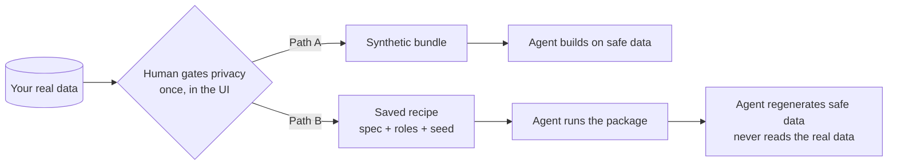

# DataGangeR

[](https://lennon-li.github.io/dataganger/articles/privacy-and-ai-workflow.html)
[](https://lennon-li.github.io/dataganger/articles/privacy-and-ai-workflow.html)
[](https://lennon-li.github.io/dataganger/articles/privacy-and-ai-workflow.html)
[](https://github.com/lennon-li/dataganger)
[](https://lennon-li.github.io/dataganger/articles/privacy-and-ai-workflow.html)

**DataGangeR** creates synthetic data doubles from real datasets so you
can prototype code, build Shiny apps, teach, and work with coding
**Agents** without sharing the original dataset.

📖 **Documentation:** <https://lennon-li.github.io/dataganger/>


DataGangeR walks you through objective, upload, configure, generate,
compare, and export

## Want an Agent to build on your data — without ever handing it over?

Let a coding **Agent** work at full speed on a synthetic stand-in for
your dataset. You decide the privacy rules once; the Agent gets safe
synthetic data — or a reproducible recipe to make it — and **never reads
the real data**. And the package makes **no network calls**, so nothing
ever leaves your machine.

- 🔒 **The Agent never touches the real data** — it gets a synthetic
  bundle, or a saved recipe (`spec` + `roles` + `seed`) it runs back
  through the package to regenerate safe data itself. The real records
  stay out of the shared bundle.
- 🧭 **The human gates privacy once** — attest there are no direct
  identifiers, then answer two questions per column (does it point to a
  person? is it sensitive?). Those answers drive the synthesis.
- 📴 **Provably offline** — the package makes no network calls and
  launches no browser; a shipped self-test and a no-network CI job prove
  it. Open source, so you can verify your own copy.
- ⚙️ **Real synthesis** — synthpop + k-anonymity for relationship-aware,
  disclosure-controlled output you can inspect (with a dependency-free
  internal engine as the automatic fallback).

Let an Agent build on your data. Keep your data. Both.



> \[!TIP\] \### 🔒 Safe to try — your data never leaves your machine ✅
> Processed **locally, in memory only** — never uploaded, never written
> to disk by the app, gone when you close it. ✅ **No network calls**
> and **no browser launch** — proven by a shipped self-test and a
> no-network CI job. ✅ **Open source** — you (or your IT team) can
> verify your own copy.
>
> No account. No upload. No cloud. Point it at a sample dataset and see
> for yourself.

## Overview

Analysts often need to share data structure with teammates, students, or
coding Agents. Sharing the original data is not always possible.
DataGangeR generates a synthetic “doppelganger” that preserves the
structure, distributions, and relationships you need for development
while reducing the need to expose original records.

> **Important:** Synthetic data is intended to reduce direct disclosure
> risk, not to replace a formal privacy assessment. Review the
> comparison and privacy warnings before sharing any output externally.

## Installation

``` r

# Development version from GitHub:
# install.packages("pak")
pak::pak(c("lennon-li/dataganger", "synthpop"))
```

**Strongly recommended: install `synthpop`** (above) for full-fidelity,
relationship-aware synthesis. It is optional — without it, DataGangeR
automatically falls back to the dependency-free **internal** engine
(with a warning), so nothing breaks; the synthetic data is just marginal
rather than relationship-preserving.

## The interactive app

The guided Shiny app takes you from a real dataset to a shareable
synthetic bundle in six steps — pick an **objective**, **upload** your
data (or load a built-in sample), **configure** by answering two
questions per column (does it point to a person? is it sensitive?) and
reviewing what DataGangeR will do, **generate** the synthetic double,
**compare** real vs. synthetic distributions, and **export** the bundle.
The sidebar also includes a **Report a problem** button with a copyable
issue report.

**How privacy gating works.** DataGangeR starts with a
no-direct-identifiers attestation, runs an early local fail-safe scan,
then hard-gates Configure until you answer two privacy questions for
every column. Those answers drive the synthesis rules and the exported
Agent workflow. See the [Privacy gating and Agent workflows
vignette](https://lennon-li.github.io/dataganger/articles/privacy-and-ai-workflow.html).

``` r

library(dataganger)
run_app()
```

| Classify columns | Compare real vs. synthetic |
|:--:|:--:|
|  |  |

## Use it from R

Every step the app performs is a plain function call, so you can script
the whole pipeline without the UI. Objective presets are:

- `development` *(the default)* — balanced protection for prototyping
  and app development
- `demo` — strongest protection, best for teaching and reviewed external
  sharing
- `analytics` — highest fidelity, with more emphasis on preserving
  relationships

An end-to-end reproducible pipeline looks like this:

``` r

library(dataganger)

dat     <- read_input("my-data.csv")          # or: individual_sample
profile <- profile_data(dat)
roles   <- detect_roles(dat, profile)
spec    <- synth_spec(purpose = "development", roles = roles, seed = 42)
syn     <- synthesize_data(dat, spec, roles)
export_synthetic(syn, original = dat, path = "dataganger_bundle.zip")

# Or do the whole thing in one call, straight from the raw file:
make_agent_bundle("my-data.csv", out = "dataganger_bundle.zip", seed = 42)

# Open a pre-filled issue for bugs, feedback, or feature requests
report_issue("The compare step was hard to interpret", context = "Shiny app")
```

The export is a single bundle: the synthetic CSV at the root, plus one
folder for the human and one for the agent.

    synthetic_data.csv            # the synthetic stand-in — the product
    human/human.md                # what was done, plus the privacy notes
    human/comparison_report.html  # real vs. synthetic fidelity
    agent/recipe.yaml             # spec + roles + seed — regenerate safe data
    agent/AGENT.md                # the agent workflow guide (never read the real data)
    agent/manifest.json

### CLI / agent workflow

The CLI follows the same spec-first pipeline an agent would use:

``` sh
dataganger profile my-data.csv --out profile.json
dataganger roles my-data.csv --out roles.yaml
dataganger spec --purpose development --out spec.yaml

# Edit spec.yaml if needed: set seed, engine/name_strategy overrides,
# acknowledge_risk: true for analytics, and disclosure_roles: <column>: <direct|quasi|sensitive|none>.
# disclosure_roles is the compatibility YAML form; the app uses identifies + sensitive as the primary model.
dataganger synthesize my-data.csv --spec spec.yaml --out dataganger_bundle.zip
dataganger inspect dataganger_bundle.zip
```

The bundle’s `agent/recipe.yaml` captures the spec, roles, and seed. To
reproduce or vary the synthetic data later, an agent runs the package
against that recipe — no notebook, and without ever opening the real
data:

``` sh
unzip dataganger_bundle.zip -d dataganger_bundle
dataganger synthesize my-data.csv \
  --recipe dataganger_bundle/agent/recipe.yaml \
  --out check.zip
```

For the full command list, run
`dataganger::dataganger_cli(c("--help"))`. Agents can print or copy the
packaged workflow guide with `dataganger skill [--out <file>]`.

## Synthesis engines

DataGangeR uses two synthesis engines. By default the engine is chosen
automatically by your objective: `demo` uses the dependency-free
internal marginal engine by default, `development` requests moderate
relationship preservation and therefore routes to `synthpop` when it is
installed (otherwise falling back to the internal engine with a
warning), and `analytics` is the high-fidelity path that requires
explicit risk acknowledgement. In the Shiny app and CLI spec you can
also choose the engine explicitly (`auto`, `internal`, or `synthpop`).
**Installing `synthpop` is strongly recommended**
(`install.packages("synthpop")`) for relationship-preserving synthesis;
the internal engine is the dependency-free fail-safe used automatically
when synthpop is absent.

Please cite synthpop when you use that engine:

Nowok B, Raab GM, Dibben C (2016). “synthpop: Bespoke Creation of
Synthetic Data in R.” *Journal of Statistical Software*, 74(11), 1-26.
<doi:10.18637/jss.v074.i11>

## Design principles

- **Package-first.** All core functions work from the R console; Shiny
  is an optional interface layer.
- **Configurable disclosure posture.** Each synthesis purpose
  (`development`, `demo`, `analytics`, etc.) applies appropriate
  defaults for coarsening, name handling, and rare-level treatment.
- **Honest comparisons.** The comparison report quantifies how closely
  the synthetic data mirrors the original so you can make an informed
  sharing decision.
- **No overclaims.** DataGangeR will not tell you the output is safe for
  public release. That determination depends on your data, context, and
  applicable regulations.

## Supported input formats

- CSV (via `readr`)
- Excel `.xlsx` / `.xls` (via `readxl`)
- SAS `.sas7bdat` / `.xpt` (via `haven`)

## License

MIT © Lennon Li
