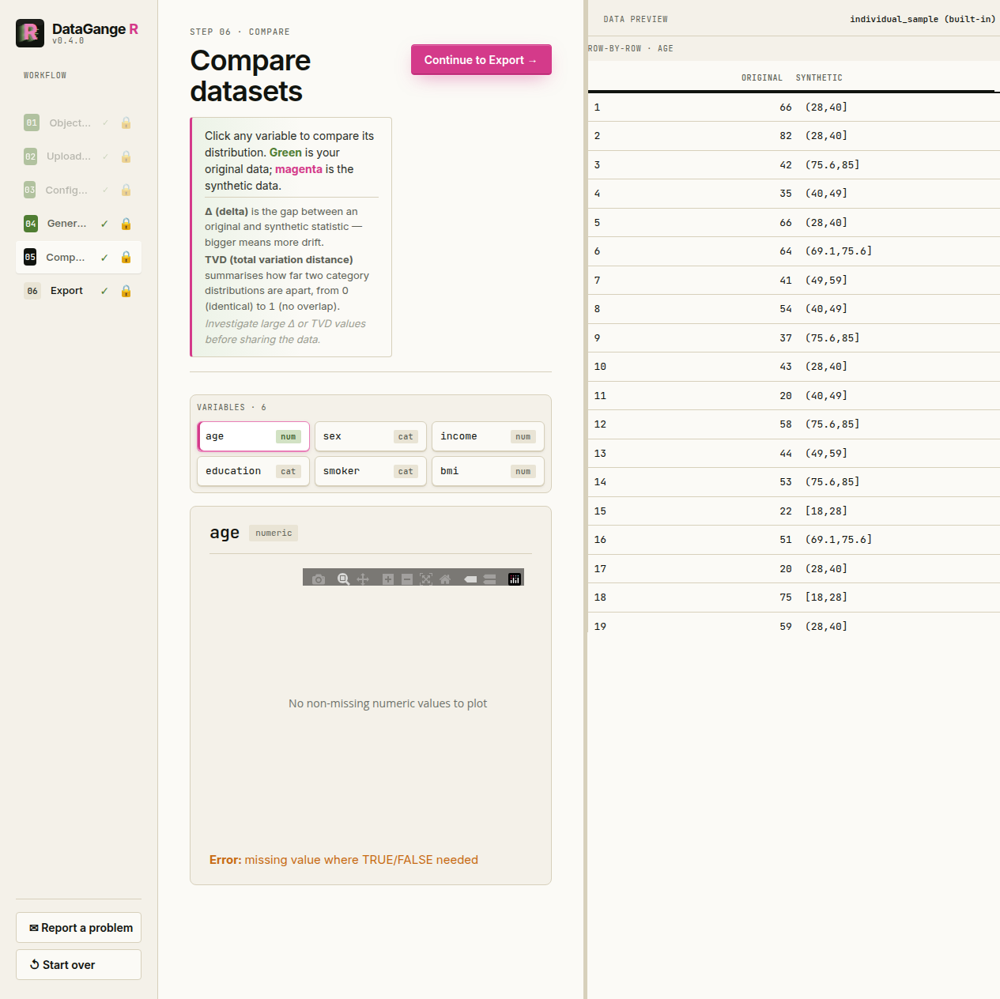

# DataGangeR

**DataGangeR** creates synthetic data doubles from real datasets so you
can prototype code, build Shiny apps, teach, and collaborate with AI
tools without sharing the original dataset.


DataGangeR walks you through objective, upload, configure, generate,
compare, and export

## Want AI to prototype on your data — without handing over the real thing?

DataGangeR turns sensitive datasets into safe, synthetic stand-ins. Your
AI assistant prototypes at full speed; the real people in your data
never leave the building.

- 🤖 **Harness AI, keep your privacy** — feed agents realistic synthetic
  data via a built-in CLI, not your production records.
- 🧭 **Human in control** — a guided UI lets you decide what’s
  identifying, sensitive, or safe, column by column.
- ⚙️ **Real synthesis** — synthpop + k-anonymity: faithful enough to
  build on, private by design.
- 🔁 **Reproducible & human-gated** — every export is a one-click bundle
  with an R script to regenerate the exact result.

Prototype with AI. Protect your data. Both.

## Overview

Analysts often need to share data structure with teammates, students, or
AI assistants. Sharing the original data is not always possible.
DataGangeR generates a synthetic “doppelganger” that preserves the
structure, distributions, and relationships you need for development
while reducing the need to expose original records.

> **Important:** Synthetic data is intended to reduce direct disclosure
> risk, not to replace a formal privacy assessment. Review the
> comparison and privacy warnings before sharing any output externally.

## Installation

``` r

# Development version from GitHub:
# install.packages("pak")
pak::pak("lennon-li/dataganger")
```

## The interactive app

The guided Shiny app takes you from a real dataset to a shareable
synthetic bundle in six steps — pick an **objective**, **upload** your
data (or load a built-in sample), **configure** by answering two
questions per column (does it point to a person? is it sensitive?) and
reviewing what DataGangeR will do, **generate** the synthetic double,
**compare** real vs. synthetic distributions, and **export** the bundle.
The sidebar also includes a **Report a problem** button that opens a
pre-filled GitHub issue in your browser.

``` r

library(dataganger)
run_app()
```

| Classify columns | Compare real vs. synthetic |
|:--:|:--:|
|  |  |

## Use it from R

Every step the app performs is a plain function call, so you can script
the whole pipeline without the UI. Objective presets are:

- `development` *(the default)* — balanced protection for prototyping
  and app development
- `demo` — strongest protection, best for teaching and low-risk sharing
- `analytics` — highest fidelity, with more emphasis on preserving
  relationships

An end-to-end reproducible pipeline looks like this:

``` r

library(dataganger)

dat     <- read_input("my-data.csv")          # or: individual_sample
profile <- profile_data(dat)
roles   <- detect_roles(dat, profile)
spec    <- synth_spec(purpose = "development", roles = roles, seed = 42)
syn     <- synthesize_data(dat, spec, roles)
export_synthetic(
  syn,
  original = dat,
  path = "dataganger_bundle.zip",
  compact = FALSE
)

unzip("dataganger_bundle.zip", exdir = "dataganger_bundle")

# Re-run the same-seed audit/comparison notebook against the exported bundle.
quarto::quarto_render(
  "dataganger_bundle/analysis.qmd",
  execute_params = list(
    original_path = "my-data.csv",
    synthetic_path = "dataganger_bundle/synthetic_data.csv"
  )
)

# Open a pre-filled issue for bugs, feedback, or feature requests
report_issue("The compare step was hard to interpret", context = "Shiny app")
```

The Shiny app downloads a compact bundle for humans. For CLI or agent
workflows, use the full bundle (`compact = FALSE`, or
[`make_agent_bundle()`](https://lennon-li.github.io/dataganger/reference/make_agent_bundle.md))
so the standalone `ai-readme.md`, `privacy_report.txt`, and other
diagnostics are included alongside `analysis.qmd`.

### CLI / agent workflow

The CLI follows the same spec-first pipeline an agent would use:

``` sh
dataganger profile my-data.csv --out profile.json
dataganger roles my-data.csv --out roles.yaml
dataganger spec --purpose development --out spec.yaml

# Edit spec.yaml if needed: set seed, engine/name_strategy overrides,
# and disclosure_roles: <column>: <direct|quasi|sensitive|none>.
dataganger synthesize my-data.csv --spec spec.yaml --out dataganger_bundle.zip
dataganger inspect dataganger_bundle.zip
```

Then unzip the full bundle and render the included notebook against the
real input file to reproduce and review the same-seed result:

``` sh
unzip dataganger_bundle.zip -d dataganger_bundle
quarto render dataganger_bundle/analysis.qmd \
  -P original_path:my-data.csv \
  -P synthetic_path:dataganger_bundle/synthetic_data.csv
```

For the full command list, run
`dataganger::dataganger_cli(c("--help"))`.

## Synthesis engines

DataGangeR uses two synthesis engines. By default the engine is chosen
automatically by your objective: lower-fidelity objectives use a
dependency-free internal marginal engine, while the **analytics**
purpose - and any high-fidelity setting, where preserving relationships
between variables matters - uses the synthpop package (Nowok, Raab &
Dibben, 2016). In the Shiny app you can also choose the engine
explicitly (auto, internal, or synthpop). Install it with
`install.packages("synthpop")` to enable relationship-preserving
synthesis at full fidelity.

Please cite synthpop when you use that engine:

Nowok B, Raab GM, Dibben C (2016). “synthpop: Bespoke Creation of
Synthetic Data in R.” *Journal of Statistical Software*, 74(11), 1-26.
<doi:10.18637/jss.v074.i11>

## Design principles

- **Package-first.** All core functions work from the R console; Shiny
  is an optional interface layer.
- **Configurable disclosure posture.** Each synthesis purpose
  (`development`, `demo`, `analytics`, etc.) applies appropriate
  defaults for coarsening, name handling, and rare-level treatment.
- **Honest comparisons.** The comparison report quantifies how closely
  the synthetic data mirrors the original so you can make an informed
  sharing decision.
- **No overclaims.** DataGangeR will not tell you the output is safe for
  public release. That determination depends on your data, context, and
  applicable regulations.

## Supported input formats

- CSV (via `readr`)
- Excel `.xlsx` / `.xls` (via `readxl`)
- SAS `.sas7bdat` / `.xpt` (via `haven`)

## License

MIT © Lennon Li
